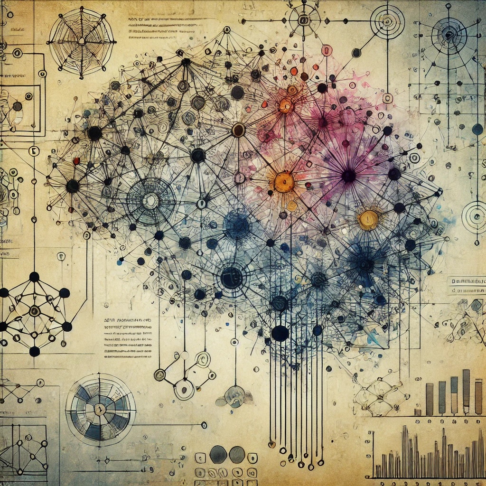

<!-- Header image with height restriction -->



# LEAD: Linear Embedding Alignment across Deep Neural Network Language Models' Representations

> [!WARNING]\
> This project was developed in around six days as a final project for [MIT's 6.7960 Deep Learning class](https://phillipi.github.io/6.7960/) and as such, there are some slight errors in our results and final analysis. Nonetheless, this project, it's methodology, and codebase may be informative to others.

This is a repository containing the source code for the [LEAD Blog Post](https://gatlenculp.github.io/embedding_translation/) by [Gatlen Culp](https://gatlen.me) and [Adriano Hernandez](https://www.linkedin.com/in/adriano-hernandez/) from MIT.

Published December 10th, 2024

## Abstract

Recent advances in Large Language Models (LLMs) have demonstrated their remarkable ability to capture semantic information. We investigate whether different language embedding models learn similar semantic representations despite variations in architecture, training data, and initialization. While previous work explored model similarity through top-k results and Centered Kernel Alignment (CKA), yielding mixed results, in the field of large language embedding models, which we focus on, there is a gap: more modern similarity quantifiation methods from Computer Vision, such as model stitching, which operationalizes the notion of "similarity" in a way that emphasizes downstream utility, are not explored. We apply stitching by training linear and nonlinear (MLP) mappings, called "stitches" between embedding spaces, which aim to biject between embeddings of the same datapoints. We define two spaces as connectivity-aligned if stitches achieve low mean squared error, inreadicating approximate bijectivity.

Our analysis spans 6 embedding datasets (5,000-20,000 documents), 18 models (between 20-30 layers, including both open-source and OpenAI models), and stitches ranging from linear stitches to MLPs 7 layers deep, with a focus on linear stitches. We hoped that stitching would recover the similarity between models, aligning with a strong interpretation of the platonic representation hypothesis. However, things appear to be more complicated. Our results suggest that embedding models are not linearly connectivity-aligned. Specifically, linear stitches do not perform significantly better than mean estimators. A brief foray into MLPs suggests that training shallow MLPs does not necessarily work out of the box either, but more work remains to be done on non-linear stitches, since we haven't fully maximized their potential here. Stitches are important, because their success can be used to determine operational, and therefore useful, notions of representational similarity. Our findings buttress the hypothesis that alignment metrics such as CKA are not always informative of behavior or feature overlap between models.

To read the rest of blog, click [here](https://gatlenculp.github.io/embedding_translation/).

## Project Overview

This project investigates whether different embedding models learn similar semantic representations by applying model stitching — a technique that maps between embedding spaces. We define and test the concept of "connectivity-alignment" to measure how effectively embeddings from one model can be mapped to another.

### Key Research Questions

- Do different language embedding models learn similar semantic representations?
- Can we efficiently translate between different models' embedding spaces using linear or shallow non-linear maps?
- Are connectivity-alignment metrics more informative than traditional similarity measures like CKA?

## Installation and Usage

```bash
# Clone the repository
git clone https://github.com/GatlenCulp/embedding_translation
cd embedding_translation

# Install dependencies with uv (recommended)
uv sync
# Alternative
pip install -r requirements.txt

```

## Project Structure

- `src/` - Source code for running experiments and analysis
  - `blog/` - Code for the blog visualization and presentation
- `docs/` - Documentation and project planning materials
- `owler_fork/` - Modified code from the Beyond Benchmarks paper

## Data and Models

Our experiments use:

- 6 embedding datasets (5,000-20,000 documents)
- 18 embedding models (including open-source and OpenAI models)
- Stitches ranging from linear mappings to 7-layer MLPs

## Other Resources

View our HuggingFace datasets [here](https://huggingface.co/datasets/GatlenCulp/LEAD-Embeddings) and our trained stitches [here](https://huggingface.co/GatlenCulp/LEAD-Stitch-Models).

Our work was heavily influenced by the _Beyond Benchmarks_ paper. The code of which we used and of which you can find the source of [here](https://github.com/casparil/embedding-model-similarity).

## Citation

If you use this work in your research, please cite our blog post:

```bibtex
@article{culp2024lead,
  title={LEAD: Linear Embedding Alignment across Deep Neural Network Language Models' Representations},
  author={Culp, Gatlen and Hernandez, Adriano},
  year={2024},
  url={https://gatlenculp.github.io/embedding_translation/}
}
```
